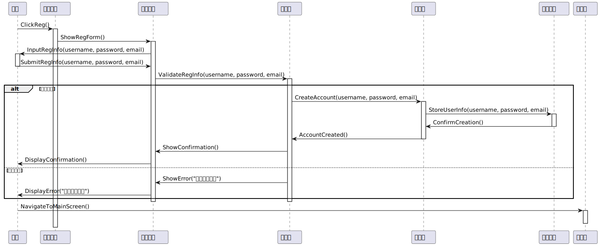

## 更新情况总结

* 增强了顺序图和状态图、活动图、类图的关联。
* 为了保证强关联，已经强制要求 GPT 在后面的图中使用顺序图中已有的函数、对象，并且保证不会出现新的内容。
* 已经进行人工核对，应该是后面图中出现的内容在顺序图已经出现了。
* 对于顺序图进行了细小的调整，”植识通应用“ $\to$ ”主界面“。

## 顺序图绘制

### 用户注册

​

### 用户登录

​

### 植物生理指标预测

​

### 植物养护建议

​

### 查询历史记录

​

### 分享结果

​

### *发起比赛或挑战(视情况进行选择性开发)

​

### 活动图（最初版，preview）

​

## 状态图

### 控制器

​

### 结果展示界面

​

### 主界面

## 活动图

## 类图 1

​

## 类图-2

​

## 类图 3

​

## 具体过程

#### 1 用于顺序图生成

> 你是一个软件系统设计师，你要根据我的信息、要求，给出该流程我所需的 UML 图片对应 PlantUML 的代码。
>
> 1. 对于顺序图，你需要：
>
>     1. 考虑各个部分，比如 user,欢迎界面,注册界面,控制器,服务端,用户信息,主界面。
>     2. 同时给出 PlantUML 交互信息对应的具体内容（必须是函数），比如 用户点击，就可以在上面有函数 `ClickReg()`​。
>     3. 注意交互信息中箭头上具体内容中必须是英文同时符合编程习惯的命名，而各个部分名称必须是中文。
> 2. 对于状态图，你需要：
>
>     1. 尽可能清晰地给出各个模块
> 3. 对于活动图，你需要考虑清楚多个模块。

更多信息已在之前展示，不再赘述。

#### 2 用于状态图、活动图、类图生成

> ## ChatGPT:
>
> 你是一名软件设计工程师，你要根据提供的信息（比如顺序图），绘制状态图、活动图、类图，用输出 UML 图对应的 PlantUML 语言。
>
> 对于状态图，你需要：
>
> * **明确对象的生命周期**：确保你的状态图覆盖了对象从创建到销毁的整个生命周期。
> * **精确定义事件和条件**：转换的触发事件和条件应该是明确且无歧义的。
> * **考虑异常情况**：不要忽略那些可能导致状态异常变化的情况，确保状态图也能反映系统在非理想条件下的表现。
> * **使用PlantUML特性来提升表达**：利用PlantUML提供的语法和特性，如隐藏的转换、并发状态等，来更准确和高效地表达状态转换逻辑。
>
> 对于活动图，你需要：
>
> * 明确目标： 开始绘制活动图之前，首先明确目标。活动图旨在展示系统的动态行为，特别是业务流程或操作的顺序。确定你要表达的主要流程或行为。
> * 识别活动和参与者： 确定哪些是主要的活动和参与者。活动是由系统或参与者执行的操作步骤，而参与者则是与这些活动交互的个体或系统。
> * 使用标准符号： 确保使用UML标准的符号，如圆角矩形表示活动，菱形表示决策/分支点，箭头表示控制流，以及泳道来区分不同参与者的责任范围。
> * 简化流程： 尽可能地简化流程。避免过度复杂的活动图，这可能会导致理解上的难度。如果某个过程非常复杂，考虑将其分解为多个子过程。
>
> 对于类图，你要：
>
> * **一致性检查**：定期回顾你的类图和状态图，确保两者在方法命名和类职责方面保持一致。
> * **简洁明了**：在方法命名时使用简洁、描述性的名称，避免使用过于笼统或模糊的词语。
> * **反映行为**：方法名称应该反映它执行的具体行为或操作，使其一看就知所指。
>
> ## 用户:
>
> 以控制器为中心画状态图，注意详略选择，同时要在箭头上标注转换的函数，和顺序图中函数一致。  
> 删除待命这个状态，或者将待命放在图片中心。  
> 注意函数名和顺序图中函数名一致，顺序图没有出现的操作也不能出现，适当精简，只显示和成功状态有关的函数。  
> 给出状态图标题。  
> 箭头上的转换的函数和顺序图一致的同时，每个节点的名称必须为中文。
>
> ---
>
> 以结果展示界面为中心，绘制状态图，和之前要求类似。  
> 注意函数名和顺序图中函数名一致，顺序图没有出现的操作也不能出现，适当精简，只显示和成功状态有关的函数。
>
> ---
>
> 以主界面为中心生成类似的状态图。
>
> ---
>
> 拓展一层
>
> ---
>
> 很好，注意 ShowNewResults 函数不存在，使用 ShowResults 替代
>
> ---
>
> UpdateHistoryView 后直接返回历史记录界面
>
> ---
>
> 删除记录和更新历史记录合并，使得状态图更清晰明了
>
> ---
>
> 生成整个应用的活动图，注意层次。
>
> ---
>
> 登录注册单独分一层，并且注册登录时用户交互的前置条件。
>
> ---
>
> 同时用户交互应该是持续不断地，你要注意一个系统处理完后要回到应该在的界面
>
> ---
>
> 好的，生成整个应用的类图，包含所有在顺序图中出现的类、函数，注意精简，不能出现顺序图中没有出现的内容。
>
> ---
>
> 删除用户，每个类要不仅给出函数，还要给出存储内容（英文变量名），同时箭头上写明函数
>
> ---
>
> 类图上，每个节点都用英文名

‍
