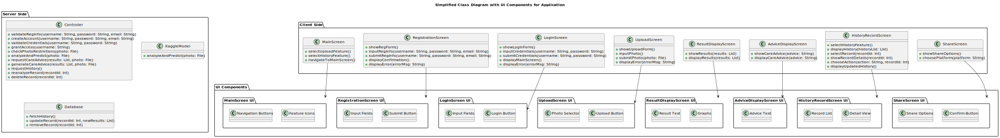

# 软工实验班 OOD 分析-初稿汇报

2300012929 尹锦润

## 问题域分析

### UML  图

简化版 UML 图：


### OOD 问题域 Part1：编程语言的设计

为了满足APP在iOS和Android上运行的需求，同时考虑到后端需要支持数据存储和Python编写的Kaggle模型预测服务，推荐的技术栈如下：

- **客户端（iOS和Android）** ：使用Flutter。Flutter是Google开发的开源框架，允许从单一代码库开发高性能、高保真的iOS和Android应用。它支持快速的开发周期和原生性能，且具有丰富的组件和库。
- **后端服务**：使用Django REST framework。Django是一个高级Python Web框架，它鼓励快速开发和干净、实用的设计。通过Django REST framework扩展，可以快速构建RESTful API，方便地与前端交互。此外，它天然支持Python，因此可以无缝集成Kaggle模型预测服务。

### OOD 问题域 Part2：硬件、操作系统以及网络设施

- **服务器硬件**：推荐使用云服务（如AWS EC2或Google Cloud Compute Engine）中的虚拟机，选择具有至少4核CPU、16GB内存的配置。这样可以根据负载情况灵活调整资源，同时降低初期投资成本。
- **操作系统**：推荐使用Linux，例如Ubuntu或CentOS，因为它们稳定、安全且对Python环境友好。
- **网络设施**：确保服务器带宽足够，以支持并发用户访问和数据传输。使用CDN服务可以加速静态资源的加载速度，改善用户体验。

### OOD 问题域 Part3：复用支持

- **开源项目**：对于图片处理和机器学习模型部署，可以利用OpenCV和TensorFlow。OpenCV可以用于图像预处理，而TensorFlow Serving可以用于部署和提供Kaggle模型预测服务的API接口。

### OOD 问题域 Part4：数据管理系统

- **NoSQL数据库**：推荐使用MongoDB。它是一个基于文档的NoSQL数据库，适合存储JSON格式的数据，如用户信息、历史记录等。MongoDB灵活的数据模型和强大的查询能力使得它成为存储动态数据和快速迭代开发的理想选择。

### OOD 问题域 Part5：界面支持系统

- **界面开发**：如前所述，推荐使用Flutter。它不仅支持跨平台开发，还有丰富的组件和库，可以快速开发美观、流畅的用户界面。Flutter社区活跃，有大量开源插件可供使用，这可以大大加速开发过程。

## 人机交互设计

### Temp1



### Temp2


### Final1


### Final2


### Final3


### Final4


## 控制驱动部分设计

### 初始版


### Final


## 数据管理设计


## 生成方式

**几乎全程 ChatGPT。**

> #### ChatGPT:
>
> 你是一名软件设计工程师，你要根据提供的信息，通常是顺序图，类图，显然这是 OOA 的内容，你的任务是，根据用户的提示，进行 OOD 的分析设计。
> 在分析过程中，你要：
>
> 1. 仔细回顾用户提供的顺序图、类图。
> 2. 保证你的设计严格遵守用户提供的设计，也就是只能出现用户提供的设计，并且保证全面。
> 3. 遵照 OOD 的要求，一步一步地进行思考，给用户最符合原来设计，最符合 OOD 需求的设计。
> 4. 输出你的设计对应的 PlantUML 的代码。
>
> #### 用户:
>
> 首先，请查看我的顺序图：<省略>接着查看目前的类图：<省略>
>
> 仔细阅读，告诉我你认为这是什么任务。
>
> #### ChatGPT:
>
> 根据您提供的顺序图和类图，这项任务是关于一个软件系统的面向对象分析(OOA)和面向对象设计(OOD)。该系统包含用户注册、登录、植物生理指标预测、植物养护建议、查询历史记录以及分享结果等功能。通过顺序图，我们可以看到不同组件之间的交互流程，而类图则展示了系统中各个类的结构和它们之间的关系。
>
> 您的要求是基于这些信息进行面向对象设计(OOD)的分析设计，并生成对应的PlantUML代码。面向对象设计将会遵循您提供的顺序图和类图的设计，确保设计的完整性和严格遵守原有设计规范。
>
> 这个任务涉及到以下几个步骤：
>
> 1. 分析提供的顺序图，理解每个功能场景下的组件交互。
> 2. 仔细研究类图，了解系统中定义的类以及它们之间的关系。
> 3. 根据顺序图和类图的信息，进行面向对象设计(OOD)，确保设计满足所有功能需求并且与原有设计保持一致。
> 4. 编写对应的PlantUML代码来表示经过OOD处理后的设计。
>
> 由于您已经提供了详细的顺序图和类图，接下来的任务是根据这些信息进行OOD设计。请确认是否需要我立即开始这个设计分析并生成相应的PlantUML代码？如果您有任何特定的设计考虑或者要求，请提前告知。
>
> #### 用户:
>
> 首先，你需要进行 OOD 中问题域的设计，在这里，你需要：
>
> 1. 简化目前的类图，明确显示问题域的内容，同时将 UML 图片变得更紧凑，输出对应 PlantUML 代码。
> 2. 了解用户的补充需求：开发一个 APP，能够在 IOS，Android 上运行，同时有一个部署在服务器上的后端，支持数据的存储以及其中重要的 Kaggle 模型预测服务（该服务使用的是 Python 代码）。
> 3. OOD 问题域 Part1：编程语言的设计。考虑一个很好的技术栈满足用户的补充需求，同时要尽量支持面向对象设计以及不能过于复杂，然后告诉用户技术栈是什么。
> 4. OOD 问题域 Part2：硬件、操作系统以及网络设施。考虑性能，输出你的推荐配置。
> 5. OOD 问题域 Part3：复用支持。考虑目前已有的技术、开源项目，如果能直接进行应用，请给用户推荐，同时告诉用户具体项目名称和用法。
> 6. OOD 问题域 Part4：数据管理系统。这里推荐使用 NoSQL 形式，但是具体形式请根据已有信息仔细考量。
> 7. OOD 问题域 Part5：界面支持系统。告诉我使用什么界面，更加推荐开源项目来节省工作量，
>    注意，先输出简化的能够真实详细反映问题域的 UML 代码，然后在 OOD 问题域的几个 Part 中，一步一步文字回答我的问题，每一步在进行分析后，一小段话给出最后你认为的最优方案。
>
> #### 用户:
>
> 很好，但是你的 UML 代码中Controller <.. Server Side : controls报错了，修改。
> 同时回顾我给你发的代码，保证你的输出函数名称和这段代码完全一致。
>
> #### 用户:
>
> 接下来每一步都要保证你和最开始发送的信息一致，同时保证能够很好的满足要求，这是你接下来的任务，进行 OOD 的人机交互设计：
>
> 1. 回顾人机交互的设计准则（记住就行）：使用简便，各个界面要信息术语一致，能很好启发用户进行操作，减少用户人脑记忆的负担，减少用户的重复输入，对于用户操作有容错机制，能够及时反馈用户的操作，在用户做出灾难性操作前要进行提醒防范。
> 2. 正式开始人机交互界面的设计，仔细考虑你之前选择的 Flutter 框架，从易于维护和满足设计准则方面，设计交互界面的具体元素，如菜单，窗口，对话框，控制板，按钮等等。
> 3. 输出 UML 代码，只能是在你最新的代码上添加或者完善元素，并且保留原有的关系线。添加的就是人机交互界面的设计，使其更加详细清晰。
> 4. 你需要把每个界面，比如主界面，欢迎界面，单独列一个包，用相关元素补充每个界面的具体情况，接着导入到 Client 包中。
> 5. 最后强调！是在最新图片上进行补充，也就是说你的单独模块添加到最新图上，使其更详细。保留最新的 UML 图的所有关系线和内容。
>
> #### 用户:
>
> 你能强制 UML 排版图片更加竖着吗，横着会很不协调
> 同时保留原来的 server side 和 client side 两个包内部元素的关系。
> 接着考虑并不以包的形式展示每个界面，而是比如在 Upload Screen 中，包含（存储） Upload Button 和 Photo Selector 两个东西。
>
> #### 用户:
>
> 在每个 UI 元素后面备注详情内容，比如 Navigation Buttons | HistoryRecordScreen,UploadScreen,LoginScreen,RegistrationScreen
> 注意备注后仍然是类中储存的内容。
>
> #### 用户:
>
> 注意在 UploadScreen 中需要一个文本输入界面，表示补充信息，History 那里需要两个操作按钮，一个重新分析，一个删除，Result 那里需要一个重新分析按钮和一个显示建议按钮。
>
> #### 用户:
>
> 历史记录界面也会和结果展示界面有联系
>
> #### 用户:
>
> 现在你的任务是进行 OOD 控制驱动部分的设计，你需要：
>
> 1. 尝试拆分 Controler 为几个子模块，比如用户信息，历史记录模块，然后分别和 Client 的类建立联系。
>
> #### 用户:
>
> 同时，将 ServerSide 拆分为 Controller 和 Database 两个模块，并且 KaggleModel 位于 Controller 处
>
> #### 用户:
>
> 删掉最外面的 ServerSide
>
> #### 用户:
>
> 现在，你要进行 OOD 的数据管理设计，在这里，你需要：
>
> 1. 对于 Database 进行进一步拆分细化，和 Controller 拆分方式一致。
> 2. 类似于和 Controller 功能对应，这是你拆分部分示例：用户信息，历史记录，养护建议记录。
> 3. 接着建立 Database 和 Controller 的关联。
> 4. 考虑你之前架构的 Database 实现方式，给出 Database 每个类中**具体存储的元素以及方式** 以及 操作该类的函数。
> 5. 将这些内容结合到最新的 OOD 图中，注意和原始信息的一致性。
> 6. 输出完整 PlantUML 代码。
>
> #### 用户:
>
> 将储存内容也要结合到 UML 图片中
>
> #### ChatGPT:
>
> 为了将存储内容和操作函数直接结合到UML图中，我会在每个数据库类中详细描述它们存储的元素以及提供的操作。这样做可以确保UML图不仅展示了系统的结构，还清楚地传达了数据管理的具体细节。
>
> ##### 更新后的OOD图PlantUML代码（包含存储内容和操作）：
>
> ```plantuml
> @startuml
> title Application Class Diagram with Detailed Database Design and Storage Content
>
> left to right direction
> 'skinparam packageStyle rect
>
> package "Client Side" {
>     class MainScreen
>     class RegistrationScreen
>     class LoginScreen
>     class UploadScreen
>     class ResultDisplayScreen
>     class AdviceDisplayScreen
>     class HistoryRecordScreen
>     class ShareScreen
> }
>
> package "Controller" {
>     class UserManagementController
>     class HistoryController
>     class UploadAndAnalysisController
>     class ShareController
>     class KaggleModel
> }
>
> package "Database" {
>     class UserInfoDB {
>         +addUser()
>         +getUserByUsername()
>         +updateUser()
>         +deleteUser()
>         --
>         +Stored Elements: {userId, username, password, email}
>     }
>     class HistoryDB {
>         +addRecord()
>         +getRecordsByUser()
>         +getRecordById()
>         +updateRecord()
>         +deleteRecord()
>         --
>         +Stored Elements: {recordId, userId, photo, analysisResults, timestamp}
>     }
>     class CareAdviceDB {
>         +addAdvice()
>         +getAdviceByResultId()
>         +updateAdvice()
>         +deleteAdvice()
>         --
>         +Stored Elements: {adviceId, recordId, adviceText, timestamp}
>     }
> }
>
> ' Linking Controllers and Databases
> UserManagementController ..> UserInfoDB : <<use>>
> HistoryController ..> HistoryDB : <<use>>
> UploadAndAnalysisController ..> HistoryDB : <<use>>
> UploadAndAnalysisController ..> CareAdviceDB : <<use>>
>
> ' Visual relationships between screens and main functions
> MainScreen --> RegistrationScreen : navigates
> MainScreen --> LoginScreen : navigates
> MainScreen --> UploadScreen : navigates
> UploadScreen --> ResultDisplayScreen : uploads lead to
> ResultDisplayScreen --> AdviceDisplayScreen : results lead to
> MainScreen --> HistoryRecordScreen : navigates
> HistoryRecordScreen --> ResultDisplayScreen : views details of
> ResultDisplayScreen --> ShareScreen : options to share
>
> @enduml
> ```
> 在这个版本的UML图中，我为`UserInfoDB`、`HistoryDB`和`CareAdviceDB`每个类添加了一个部分来描述它们存储的元素。此外，我也列出了每个数据库类提供的操作函数。通过在UML图中包含这些信息，我们能够更全面地理解每个数据库组件的职责和功能，以及它们如何支持应用程序的数据管理需求。
>
> 这种设计方法有助于开发团队和利益相关者更好地理解系统的数据层面，确保在实现阶段可以高效地进行数据结构和数据库操作的开发。
