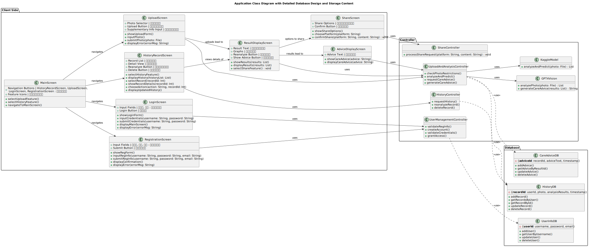

## 引言

这是软件工程实验班中对于“ChatGPT 能否真正替代人类 / 使得普通码农成为超级码农^（无需相关行业知识，依靠 GPT 即可担任完成复杂、学科交叉性任务）^”探索的第二部分，利用 GPT 进行软件分析（OOA & OOD），为下一阶段 GPT 利用分析结果生成代码做准备。

### 探索内容

笔者感觉，这部分略简单一些，但是仍然面临很多挑战，不过最后结果还算令人满意。

主要内容：通过和 GPT 合作，利用之前生成的项目需求，生成软件工程面向对象分析 OOA、OOD 图示，而这一部分的质量很大程度上决定了下一阶段利用 GPT 进行 OOP 生成代码的难易程度。

### 探索难点

* GPT 无法很好地进行 OOx 中模块的拆分构建，如果你问的非常笼统，那么它回答得就很笼统。
* 如果没有很好的提示词，那么 GPT 就会在生成中胡乱增添东西，给人”一种每张图都还能看，合在一起就一团乱麻“的感觉。

### 具体信息

* 使用模型 & 工具：GPT-4-turbo-preview(OpenAI API) 配合 [ChatGPTNextWeb](https://github.com/ChatGPTNextWeb/ChatGPT-Next-Web)（开源的 GPT 客户端）。
* 工具：PlantUML（类似于 $\LaTeX$，根据一串代码产生一张 UML 图片，可以很好地摆脱 GPT4-Vision）
* 使用者：北大大一信息与计算科学专业学生，大概用了几个小时临时学习了 OOA、OOD 相关概念内容。
* 学习参考主要材料：[软件工程_北京大学_中国大学MOOC(慕课) (icourse163.org)](https://www.icourse163.org/course/PKU-1003177002?tid=1472107442)。

## 探索过程 | OOA

### 顺序图

起初，笔者直接让 GPT 根据项目用况生成 OOA 的图片，GPT 很快给出了结果，但是生成的图非常单薄，非常笼统。

接着笔者灵光一线，既然 GPT 不会拆分项目，那我给它打个样，就行了，于是就有了这条提示词：

> 对于顺序图，你需要：考虑各个部分，比如 user,欢迎界面,注册界面,控制器,服务端,用户信息,主界面。

这个后面的 <u>user,欢迎界面,注册界面,控制器,服务端,用户信息,主界面</u> 是根据老师发的优秀示例中第一张图上面有的部分直接复制过来的，于是 GPT 效果好了点。

然后笔者发现，这个还是有点乱，主要是如果每个箭头上面都有函数，就更好了，于是就有了：

> 1. 同时给出 PlantUML 交互信息对应的具体内容（必须是函数），比如 用户点击，就可以在上面有函数`ClickReg()`​。
> 2. 注意交互信息中箭头上具体内容中必须是英文同时符合编程习惯的命名，而各个部分名称必须是中文。

在根据一些小修小改，GPT 就有了惊人的效果，这个和普通的直接生成区别非常大：

### 活动图、状态图、类图 - 1

#### 结果

这里笔者并没有拿到很好的示例，于是最开始的图片是这样子的：

状态图示例：

类图示例：

活动图示例：

#### 不足

* 图片很庞杂，很乱。
* 活动图和前面的顺序图对不上，比如一个很简单的控制器就已经不知道哪里去了。
* 还有一些小问题，都是大体一看还行，多看几眼就知道很不行。

### 活动图、状态图、类图 - 2

#### 主要改进思路

* 前面指出的顺序图和活动图没有对上，于是在 prompt 中强制和顺序图的函数名称一样，并且保证所有顺序图中内容全部在这几个图中体现，不能凭空捏造。
* 同时，对于一些 GPT 无法想象出的内容，笔者自行想了个框架，提示 GPT 进行分块，生成了最后的图。
* **效果要好很多。**

![plantuml.com/plantuml/svg/XPJ1RjD054NtynLUsYZz0HQeKHO52QGgbTW0Yv7zIaOuup8pfYgh1cWmfGgH888AsYebKCJ2eGXQr0ZwC_7O_Wjcb4Hs4YjTFIMwzxnxtqHPvW8puTTT98XmmP2jaoWuY_Q_nRjdShiHXzsutKJethK7njBI3MDusPMDVlfzB-atKFw3STsuYrtYO05LU7YBhdkcpu5HN8UIiO4vt_IOKpAWZebhtQSJROM10rGGxF82lOMcT-W4oQ-lCZYFWe_Hu48jLG25ATksvrEnO2MQycbGTDg9UnTnDqp2dWAjrRpDYaVN2QjZGJngMcXAeItg2WM9P2kG1y-Jy39z7ohG2iDKg430iqeMoej6hW__57puPn1tzjA3ut62EvZGDPi1wFqpaaKHFc_Beo_npadywcMwtrOlg4zJ0_lHQiqJNXMuOCJMjRYveR-nqBnbT9MWAG_RwV4B-VkrOfGfThUUGfawgmmSXPZOyxhyEGTlvU6dSHcrrdS5DzbeMYYlMT0cwP_BqsVHpa3kzjHh9Q4-QnKU-wf61JCeEq-83HDioHX7Ah1fMlpkI0Rj6TeAK61Om09SWI_hEOFJRNCeh0TOQ5vxTUjMCthpCmb_H7yxMUkRX0kFRPaMAb1blwOPiqurSTP6yxOQ5ffNPxcMWJhwx-0_](../assets/net-img-XPJ1RjD054NtynLUsYZz0HQeKHO52QGgbTW0Yv7zIaOuup8pfYgh1cWmfGgH888AsYebKCJ2eGXQr0ZwC_7O_Wjcb4Hs4YjTFIMwzxnxtqHPvW8puTTT98XmmP2jaoWuY_Q_nRjdShiHXzsutKJethK7njBI3MDusPMDVlfzB-atKFw3STsuYrtYO05LU-20240409232155-j4ngr0e.svg)

‍

## 探索过程 | OOD

### Part1

#### 主要思路

* 最开始给出顺序图、类图，根据 MOOC 中内容一步一步设计 prompt，过程中保证和之前信息一致，很好的保证了内容。
* 接着有很多大模块 GPT 也拆不清，笔者作为一个小白，大体想象了一下结构，参照了一下 MOOC 结构，让 GPT 进行如下操作：

  * 问题域设计
  * 人机交互设计
  * 控制驱动设计
  * 数据管理设计
* 而在操作过程中，笔者也逐渐对于 OOD 的结构有了清晰的认识，让 GPT 对于类图进行加强：

  * 人机交互对应的是 UI 部分加强
  * 控制驱动对应的是 Controller 加强，让 GPT 根据使用者的设想，进行模块拆分。
  * 数据管理对应的是 Database 加强，类似进行拆分。
* 于是笔者在不知道 MVC 结构的情况让 GPT 设计了一个很好的 MVC 形式的 OOD 图片。

#### 结果

​

#### 亮点

* GPT 很好地将 UI 内容融入了类图，并且笔者的要求描述得非常清楚。
* 整个图是 MVC 结构，让人非常容易理解，而且笔者相信对于 GPT 也是非常容易理解的。
* 整个图和原来的 顺序图函数都是一致的，确保了连贯性。

#### 略微不足

* 仍然缺失了一些模块。
* 老师指出，因为模块的拆分，这个图和顺序图有所不同，于是还要重新生成顺序图。

### Part2

#### 主要思路

* 考虑到上一张 OOD 已经比较完善加上时间不够，于是笔者重点进行顺序图的对齐。
* 重点就是让顺序图和 OOD 保持对齐。
* 接着重新利用顺序图修改 OOD。

#### 结果

以查询历史记录为例：

原来的：

​

新的：

​

同时这是最后的 OOD 图：

​

#### 亮点

* 很好地进行了对齐，补足了剩下的内容，有了清晰的架构。

#### 略微不足

* 实际上整张图是在笔者精心提示下，才有了很好的效果的，GPT 无法自行进行精确优美地进行划分。（不过 GPT 还是承担了 $90\%$ 的工作量）
* 生成过程中仍然需要笔者进行仔细地检查，GPT 在超长文本时候仍然存在细节遗漏的现象。

## 总结-GPT 下的 OOA & OOD 生成

### （笔者认为的）最佳方案

* 先进行顺序图的生成，生成时必须有一个好的提示词，像之前一样提示GPT 拆分示例，同时防止 GPT 乱搞，要求 GPT 在顺序图的每个过程给出符合编程习惯的函数命名。（注意这里和 OOD 已经有所重合）
* 接着可以进一步生成状态图、活动图，但是笔者认为这一部分没有太大作用。
* 在接着直接生成类图，并且在此基础上进行 OOD 生成操作。
* 对于 OOD 生成，最好告诉 GPT 采用一种结构方式，比如 MVC 形式，可以让图更加结构清晰分明。
* OOD 生成时，在前端对应对象中存储 UI 内容，在控制器、数据库中采用拆分方式。然后其他内容（如函数名）尽量和顺序图保持一致。
* 利用 OOD 生成最后的顺序图等等。
* 最后再用类似方法重新生成 OOD 图。

#### GPT 下的改进

* 笔者认为，OOA OOD 在 GPT 下分界线已经弱化了，在 OOA 的时候就已经用了 OOD 的形式保障了良好的效果。
* 因此 OOD 几乎可以和 OOA 同时进行，一次完成通关。
* 但是需要人工不断矫正，至少进行一次迭代操作，保证内容一致性。

## 总结-GPT 下的 OOA & OOD 作业评价标准

* 目前的选择方向：根据提示 GPT 程度、根据最后的结果程度。
* 笔者认为评价标准：**大部分看结果程度以及节省人的精力程度，适当看提示程度**。
* **看结果**：最后的效果是要服务于 GPT / 人 生成代码的，因此如果结果不适合 GPT / 人 生成代码，那么过程等于就只有同情分。而最后的效果，笔者认为更应该看**结构和类划分程度、所有图的衔接一致度**。

  * **在结构和类划分程度上，可以使用人眼来进行判断**。尽管最后如果使用 GPT，GPT 可以通过 PlantUML 代码无视图的美观程度，但是我们不能否认，在人眼看来很好的 UML 图，一定是藏着一定原因，比如结构清晰，类划得很好，这些都是有利于 GPT 进行面向对象生成的。
  * **所有图的衔接一致度，重点看函数名称、类的名称是否有凭空生成或者消失现象。** 因为对于最后的生成，如果结构不一致，那么生成会非常痛苦和难受。
* **节省人的精力程度：** 因为本课程就是看 GPT 对于现在码农的影响，于是人的参与程度和劳动强度是一个很大的参照量。
* **提示程度：** 笔者认为这个是辅助评价内容。因为这里最终是为了生成代码服务，如果结果很好，那么这里随便看看就行，如果结果不行，从这里可以看到经验教训，也**很符合课程的实验性质。**

## 最后的总结感悟

* GPT 不能完全替代人，但是在 GPT 加持下，人只需要对于一个领域进行简单的了解，能够看出 GPT 结果的效果即可，然后快速应用该知识。
* 因此，**GPT 最后的结果和人的提示水平和观察结果水平紧密挂钩**。
