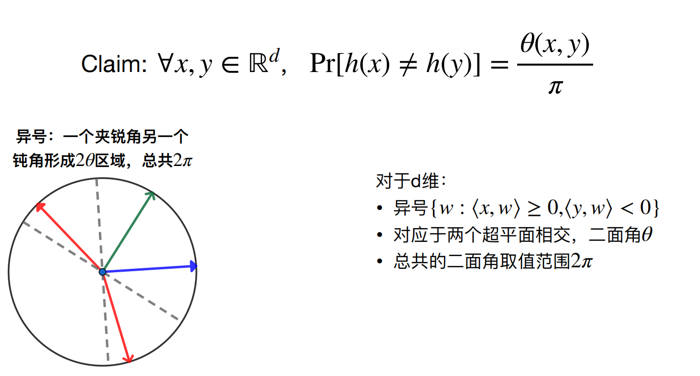

**声明：误差分析略去。**

## 适用问题

### Jaccard Similarity

### **定义**

两个集合交集大小与它们并集大小之比。

### 常见问题

- **推荐系统**：计算用户或物品之间的相似性。通过比较用户的购买历史、观看历史或偏好列表，可以识别相似的用户或物品。
- **社交网络分析**：评估用户之间的关系密切程度或群组内部的相似性。用于优化社交媒体平台上的用户连接和社区发展。
- **生物信息学**：比较基因序列、蛋白质序列或生物标记物的集合，以识别相关的生物实体。适用于基因组学和蛋白质组学研究。
- **图像处理和计算机视觉**：比较图像特征的集合，帮助识别和分类相似的图像或物体。用于图像检索和模式识别任务。

### Cosine Similarity

### **定义**

通过测量两个向量的夹角的余弦值来判断它们之间的相似度。其值的范围从 $-1$（完全相反）到 $1$（完全相同），$0$ 表示独立，常用于正空间中，意味着两个向量的方向相同程度的度量。

### 常见问题

- **文本分析和信息检索**：计算文档或文章之间的相似性。通过比较词频向量，可以识别主题或内容相似的文档，常用于搜索引擎和推荐系统中。
  
  - TF-IDF（Term Frequency-Inverse Document Frequency）用于评估一个词语对于一个文件集或一个语料库中的其中一份文件的重要程度。TF-IDF 值随着词语在文档中出现的频率成正比增加，但同时会随着词语在语料库中出现的频率成反比下降。
    
    - **词频（TF）** ：词频是一个词在文档中出现的次数。$\text{TF}(t, d) = \frac{\text{在文档 }d\text{ 中词 }t\text{ 的出现次数}}{\text{文档 }d\text{ 中的词总数}}$。
    - **逆文档频率（IDF）** ：逆文档频率是对一个词普遍重要性的度量。$\text{IDF}(t, D) = \log \frac{\text{语料库 D 中的文档总数}}{\text{包含词 }t\text{ 的文档数目}}$。
    
    TF-IDF 值由其词频和逆文档频率的乘积表示：$\text{TF-IDF}(t, d, D) = \text{TF}(t, d) \times \text{IDF}(t, D)$ 。
  
  - 对于语料库中的每个文档，计算出每个词的 TF-IDF 值，进而将文档表示为一个向量，其中每个维度对应一个唯一的词，其值为该词在文档中的 TF-IDF 权重。**Cosine Similarity 用于计算两个向量之间的余弦角，作为它们之间相似度的度量。**

- **用户画像与个性化推荐**：分析用户行为和兴趣点。通过比较用户行为向量，为用户推荐内容或商品，改善用户体验。

- **群组分析**：在社交网络分析和市场细分中，用于评估用户群体或产品类别之间的相似性。

### Hamming 空间最近邻

### **定义**

- Hamming 空间：固定长度字符串或二进制向量上的度量空间。
- Hamming 距离：是两个对象在相应位置上值不同的元素数量。
- Hamming 空间最近邻 问题：快速找到与给定查询最相似（即 Hamming 距离最小）的数据库中的项目。

### 常见问题

- **生物信息学**：用于基因序列分析，通过计算序列之间的 Hamming 距离来识别相似的基因或突变。
- **图像和视频处理**：在图像识别和视频去重中，通过比较图像或视频帧的二进制哈希值，快速识别相似的内容。
- **网页搜索中的应用**：用于增强搜索引擎的效率和准确性。通过对网页内容或结构的哈希值进行 Hamming 距离计算，搜索引擎可以快速识别和排列那些内容上或结构上与查询请求最接近的网页。这种方法特别适用于处理大量的网页数据，帮助减少计算资源的消耗，并提高响应速度。此外，它也用于检测网页的微小变化，帮助搜索引擎及时更新其索引。

## 涉及算法

- MinHash 计算 近似 Jaccard Similarity

- SimHash 计算 近似 Cosine Similarity

- Hamming 空间近似最近邻
  
  ### 

## MinHash 计算近似 Jaccard Similarity

### 主要思路

对于集合 $A$ 计算一个 Hash 值 $H(A)$，而两个集合的 Jaccard Similarity $J(A,B)=\begin{cases}\frac{|A\cap B|}{|A \cup B|} &|A\cup B|\neq 0 \\ 0 & |A\cup B| = 0\end{cases}$ 可以通过 $H(A),H(B)$ 得到。

### 具体思路

- 对于每个元素计算随机哈希 $h(x) \in [0, 1]$。
- 计算 $H(A) = \min_{x\in A} \{h(x)\}$。
- **Claim：**​**$\mathrm{Pr[H(A)=H(B)]=J(A,B)}$**。

### 实现方式与误差

- 设计 $T$ 个独立 Hash，然后计算 $H(A)=H(B)$ 的概率。
  
  - 注意，通常要映射到一个更大的值域上。

- 当 $T=\mathcal{O}(\log n)$ 时，有失败概率 $1/{\rm poly}(n)$。

### 原理

给定两集合 $A$ 和 $B$，及它们并集 $U = A \cup B$ 与交集 $I = A \cap B$ 。选定一个哈希函数对 $U$ 中元素进行哈希，某元素成为集合 $A$（或 $B$）最小哈希值的概率等于该元素在集合中的比例。

随机选取 $U$ 中的元素，该元素属于 $I$ 的概率为 $I$ 大小与 $U$ 大小之比，即 Jaccard 相似度 $J(A, B) = |I| / |U|$。因此，两集合通过相同哈希函数得到相同最小哈希值的概率即为它们的 Jaccard 相似度。

## SimHash 计算 近似 Cosine Similarity

### 具体思路

- 在 $d$ 维空间中定义一个随机高斯向量 $w$（先生成 $d$ 个独立值，然后归一化）。这个向量相当于从在 $d$ 维单位球中随机选择一个点。
- 对于给定的数据点 $x$，SimHash 哈希函数 $h(x)$ 定义为 $h(x) = \text{sgn}(\langle w, x \rangle)$，其中 $\text{sgn}(\cdot)$ 是符号函数（取值 $0,1$），$\langle \cdot, \cdot \rangle$ 表示向量的点积。
- **Claim：**​**$\rm Pr[h(x)\neq h(y)]=\frac{\theta(x, y)}{\pi}$**​ **。**

### 实现方式

- 使用多个随机高斯向量生成一组 SimHash 哈希值，然后通过比较 Hamming 距离 来近似计算 Cosine Similarity。

### 原理

---

我们发现，在这里将 Cosine Similarity 转化为 Hamming 空间上的 Hamming 距离了，于是引出一个重要的问题：如何求 Hamming 空间最近邻？

## Hamming 空间近似最近邻查询

给定 $n$ 个 $d$ 维的 Hamming 空间（每个维度是二进制）上的点，其中 $d$ 通常不大 $\leqslant 64$。

### 主要思路

- 对于查询 $q$，正确的答案为 $q*$，距离为 $r$。
- 将所有位进行随机排序，会存在某个 $k$ 使得 $q,q*$ 前 $k$ 位相同概率比较大，和 $q$ 距离超过 $cr$ 的 $q'$ 前 $k$ 位完全相同的概率比较小。
- 只需要找到随机排序后的最长公共前缀的元素们即可。

### 具体思路 & 实现方式

- 预处理，生成 $T$ 组 $d$ 维度的随机排序，然后每个随机排序下的点再进行排序。
- 查询 LCP 时，只需进行二分，然后从二分位置从前从后找到 LCP 相同（用 `__builtin_clz`​）的即可。
- 将 $T$ 组找到的元素综合（预计找到 $2T$ 个，可以拿出每次二分后的前后元素），用 `__buitin_popcount`​ 进行比较找到近似最近邻。

## 算法关联

主要讨论 MinHash 计算 近似 Jaccard Similarity、SimHash 计算 近似 Cosine Similarity 和 Hamming 空间近似最近邻 的关联。

### Locality Sensitive Hashing (LSH)

称 hash h 是一种 LSH，若 $\rm Pr[h(x) = h(y)]$ 很大，则代表 $x$ 和 $y$ 相似。

显然 MinHash 和 SimHash 都是 LSH。

### LSH 转 Hamming 空间

- 我们发现，对于 SimHash 已经转为 Hamming 空间问题了。
- 对于 MinHash，我们令 $g(x)=[x\geqslant 0.5]$，然后复合上 $h(x)$ 即可，因为如果 $h(a)=h(b)$ 则 $\rm Pr[g(a)=g(b)]=1$，否则 $\rm Pr[g(a)=g(b)]=0.5$，因此 $\rm Pr[g(H(A))=g(H(B))]=J(A,B)\times 1+(1-J(A,B))\times 0.5=\frac{1+J(A,B)}{2}$。进而就是 Hamming 空间问题了。

‍
