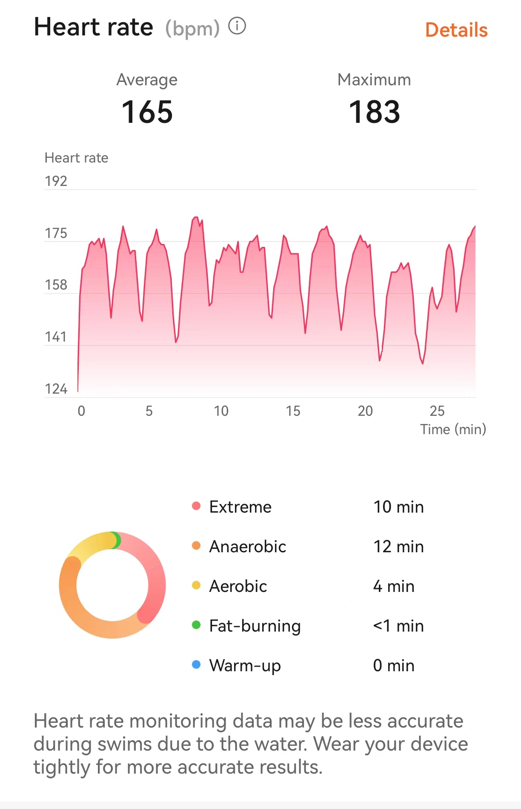

### 战况

　　今天中午一点多去游的（和好兄弟讨论~~辩论~~有意思的话题忘了时间去吃饭和游泳了），先是游了 400 米超慢速然后游了 600 米略微快速（但是每次到尽头都会休息 10s），接着没有过瘾，又游了 400 米慢的，最后是游泳时间段结束被迫离去，差点就游了 1500 米了。

　　有意思的是，身为初学者，我用非常费劲、非常慢的方式游了 1400 米，其中这个是中途 600 米开手表记录心率的结果，硬生生地把有氧运动干成了无氧运动（甚至一度怀疑手表心率不准）

　　

### 睡觉

　　这是更有意思的感觉了，游泳的时候，我逐渐开始放松，开始闭上眼睛，把自己想象成一条自由的鱼，漫无目的地游着，偶尔睁开眼睛确保不会和别人撞上。

　　简而言之，**我在养生游泳的时候开始睡觉**：

> 游泳（这样蛙泳）何尝不是一种睡觉：
>
> 1. 非常舒服地趴着
> 2. 闭上了眼睛，偶尔睁开
> 3. 经常被奇怪的声音打断
> 4. 经常一动不动，经常出现机械性动作
> 5. 什么没不想，但是开始做梦
> 6. 明明过去了很久，但是感觉只有一小会儿
> 7. 经常没睡饱，还想继续睡😴

　　而且我突然发现，这么游泳是非常开心的，闭上眼睛后，就将更多注意力集中到了身体的其他地方，就静静地听着耳边的水花声，听着自己吐气的声音，或者感受脚划水的反冲力，或者感受头砸到水中的感觉……

　　**什么也不用想，就感受一切。** 就让时间像水一样慢慢流淌，慢慢从身体上划过。有那么一瞬间，感觉整个世界都只有自己一个人，慢慢地游着，漫无目的地穿梭着，尽管很清楚终点在哪里，但是在到达终点前，在一切结束前，还是想好好地体验一把，体验整个世界。

　　**睁开眼的时候，也许就是白日梦的一瞬。** 就在这一瞬，我会想起很多东西，也许是最近的事情，也许是未来的思考，也许是在意的人，也许是我的曾经，很多美好压过了悲伤，汇聚在这一瞬之中。这一瞬，也像梦一样，做过了就忘记了，但我的开心证明，这一瞬曾在我的脑海涌现。

---

　　这样游着，非常养生，可以当做睡觉，也可以用一个更专业的词来形容，<u>正念/冥想</u>，我游泳的时候也许勉勉强强地进入了这种状态吧，非常喜欢这种感觉，**继 防止游泳课挂科、改善身材、锻炼 以外，又多了一个让我去游泳的理由了**。
