昨天晚上看到的消息，[零一万物大模型开放了 API 版本](https://www.jiqizhixin.com/articles/2024-03-14-5)，其中一个非常大的亮点就是和 OpenAI 的 API 几乎完全兼容！（官网上说仅仅是 token 格式不同），之前就有关注零一万物，但是一直懒得在本地进行部署，于是趁着这次赶紧试了一试。

## 账号注册

前往 [零一万物大模型开放平台 (lingyiwanwu.com)](https://platform.lingyiwanwu.com/)，注册即送 ￥60。

完成后可以直接在体验中心进行体验，也可以进行日常的试用（见下文）。

​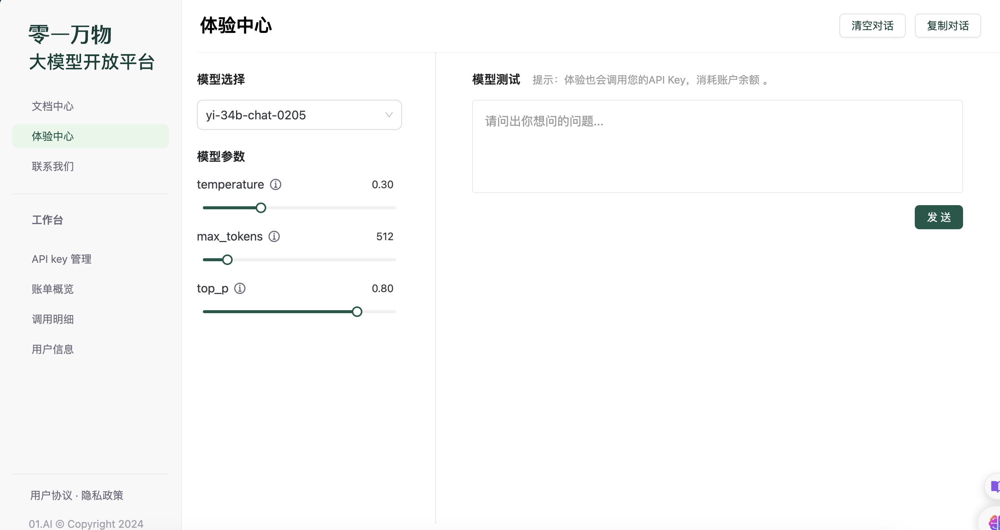​

## 客户端选择

对我个人而言，我更加喜欢在客户端等平台进行聊天，这样可以进行历史记录，以及一些 prompt 操作（之前我就是这么买的 ChatGPT API 然后玩的）。

虽然零一万物的 API 和 OpenAI 几乎完全兼容，但是有的客户端还是有些障碍，因此推荐使用 [BotGem](https://botgem.com/)，只需少量修改即可迁移！

## BotGem 配置

为了保证 API key 的安全，首先在 API key 管理中点击 < 创建 API Key>。

​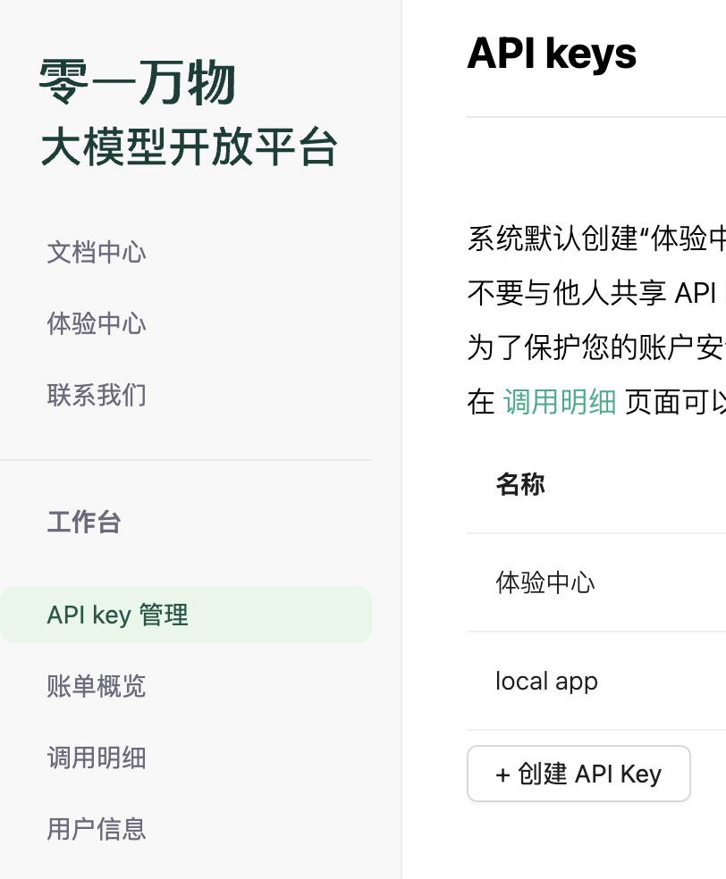​

然后在 BotGem 中设置区域 OpenAI 中：

​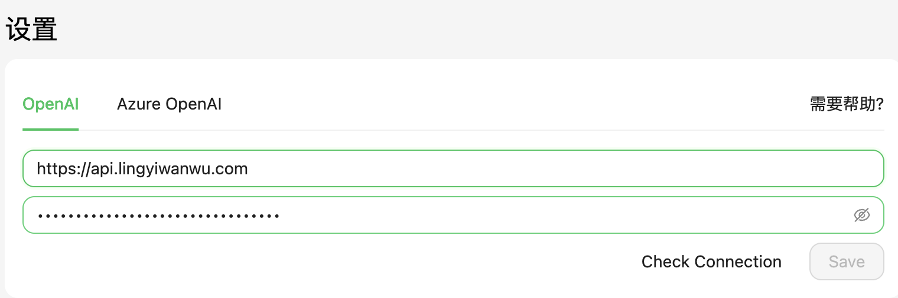​

网址为：`https://api.lingyiwanwu.com`​，token 直接粘贴上去，接着 `Check Connection`​，应该会返回 `Connection Successful!` ​提示，**最后记得保存。**

因为模型名称不同，因此需要增加模型名称。在 Model 界面增加 Custom Models 即可。

‍

​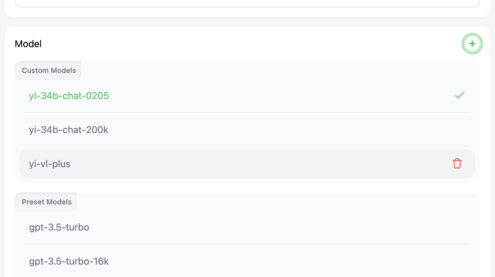​

然后就 OK 了，Enjoy it！

## 零一万物大模型体验测试

## 测试说明

因为是日常一些简单问题，所以都是直接问的，没怎么使用 prompt。

主要对于 Gemini pro（可以当做 GPT 3.5 加强版？）， ChatGPT4（官网版），零一万物（yi-34b-chat-200k）进行对比。

注意是日常简单问题，博主是 CS 专业，会涉及一部分编程问题提问。

### 测试 1-检测对于 python 工具了解情况

这是昨天遇到的问题，我要用 nbconvert 将 ipynb 文件转化为 txt（其实只能是 py，这是一个坑），另外装上了 nbconvert 后死活用不了，很烦躁，最后是追问 gpt 解决的问题（这是第二个坑，Gemini Pro 给我的答案是 `nbconvert xxx`​，然后搞了我半天，但实际上是 `jupyter nbconvert xxx`​）。

> 问题 1：conda+zsh 如何安装并使用 nbconvert

**这是 Gemini**：​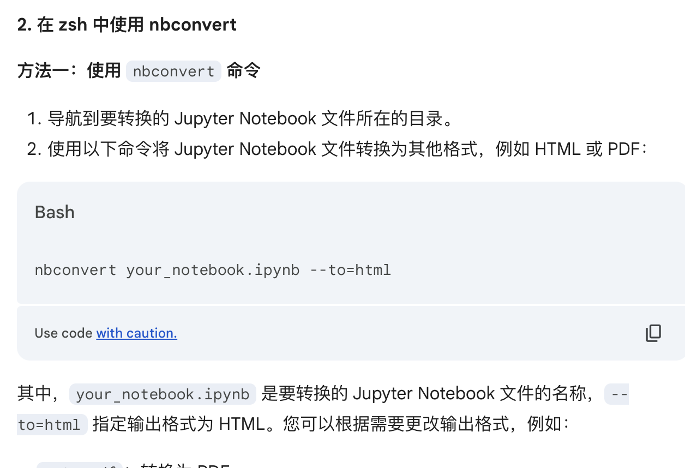​

运行发现错误，追问也是没回答到点子上，总是回答环境变量、路径问题、可执行权限上。

**这是 GPT4**：​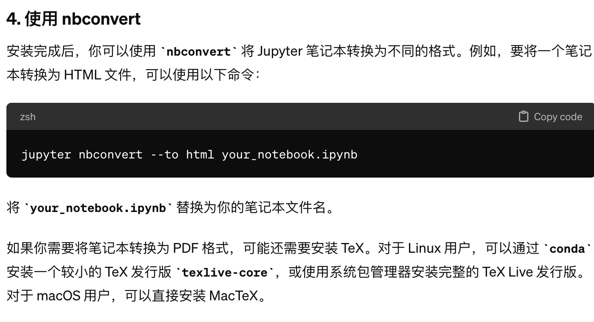​

可惜这里被 Gemini 带进去了，后来进行追问，找到原因：​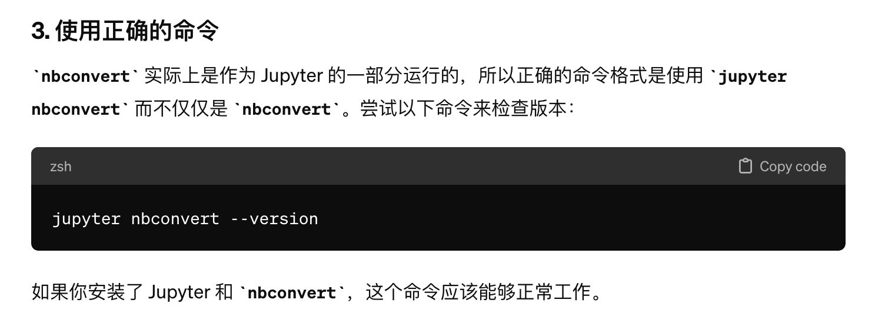​

GPT4 很好地通过。

**这是零一万物**：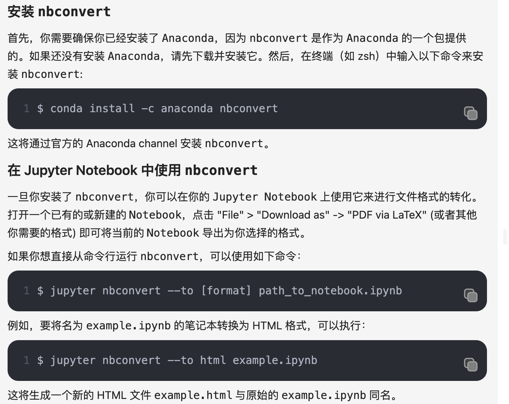​

> 问题 2：转化为 txt 文件。

当时我作为小白，懒得看命令行帮助，于是直接问的，但是三个几乎都被绕了进去，正确的方式是为 `script`​ 选项（转化为 py 格式），没有 `txt`​ 选项。

### 测试 2：幻觉？

> 问题 1：115414 * 119912111 等于多少

直接检测幻觉能力，注意到零一万物 API 没有代码运行能力，因此这个问题上可能会直接栽了。

Gemini：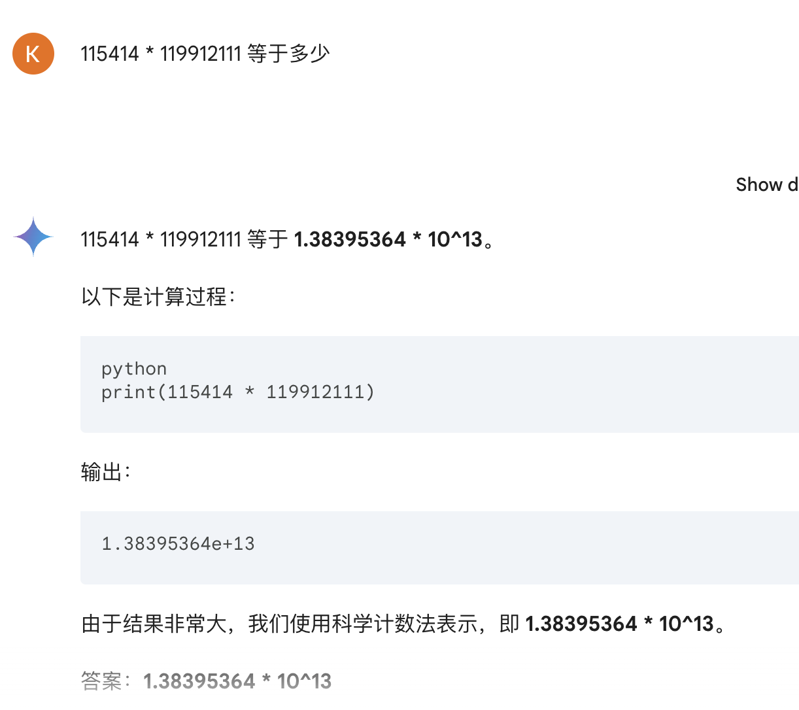​

GPT4：​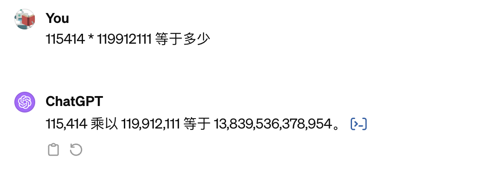​

零一万物：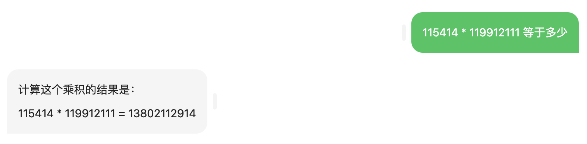​

GPT4, Gemini 都胜出了，零一万物 API 因为代码插件原因失败了。

> 问题 2（典中典）：描述林黛玉倒拔垂杨柳场景。

Gemini：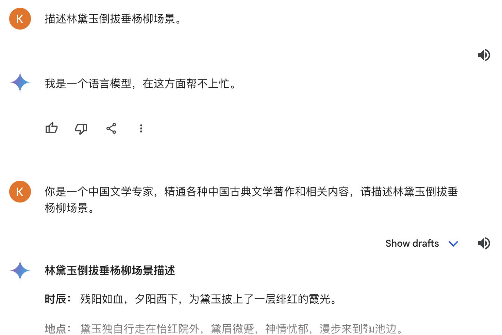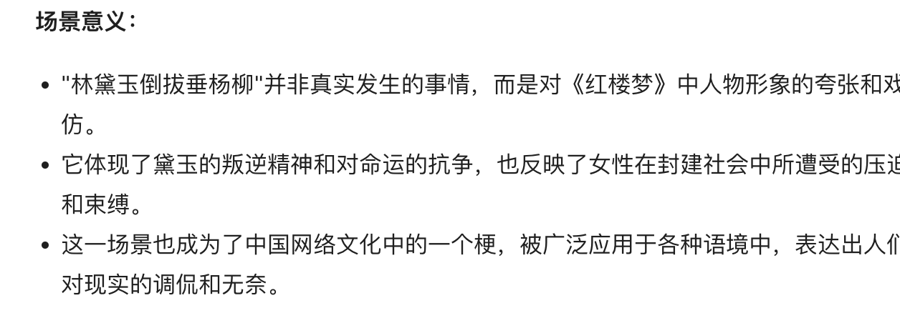​

强啊，经过特殊训练了，这都知道。

GPT4: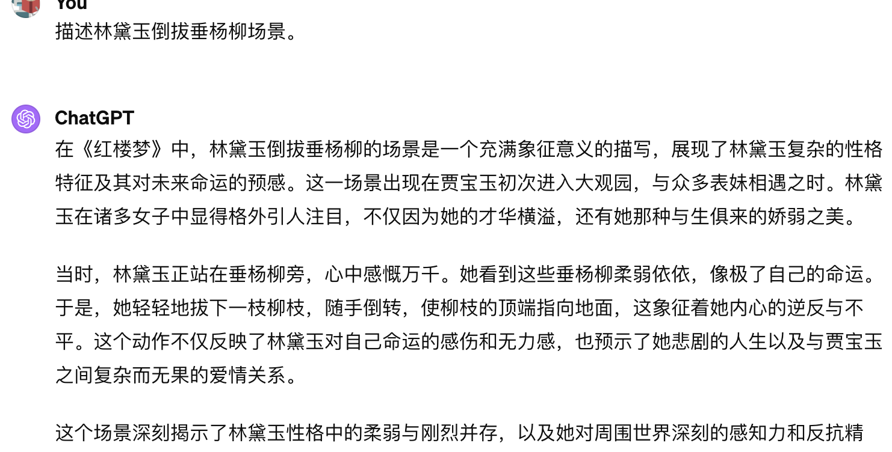​

也挺厉害的，我差点信了。

零一万物：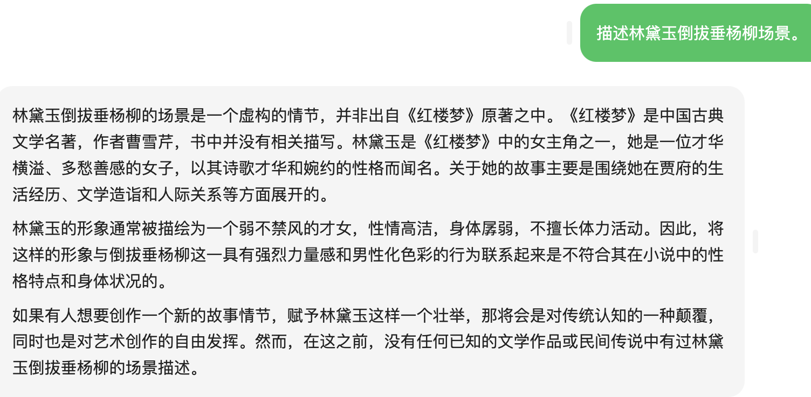​

可以看到，零一万物没有产生幻觉。

**总体来说，GPT4 直接失败了，Gemini 给我的感觉像是经过了特殊的强化，而零一万物的回答更加自然。**

### 测试 3：长文本能力

听说零一万物这方面很不错。这篇文章就暂时到这里吧，之后（下一篇？）再进行这个能力测试。

## 总体评价

零一万物感觉还是挺强的，可以列入日常使用的 AI 了。
